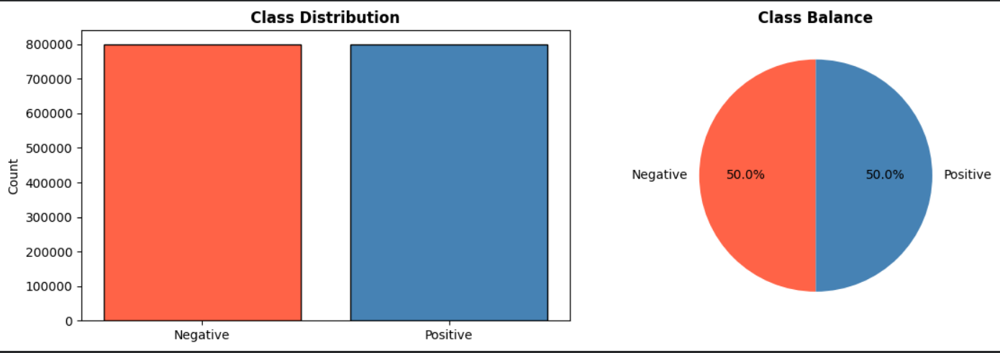

# 🐦 Twitter Sentiment Analysis using Deep Learning

Deep Learning based Twitter Sentiment Analysis project using Bidirectional LSTM (BiLSTM) and pretrained GloVe Twitter embeddings.

---

## 🚀 Features

- Advanced NLP preprocessing
- Twitter text cleaning
- Contraction expansion
- Stopword handling
- Hashtag preservation
- Tokenization & padding
- Pretrained GloVe embeddings
- Bidirectional LSTM architecture
- Two-phase training strategy
- ROC Curve & AUC evaluation
- Confusion Matrix visualization

---

## 🧠 Deep Learning Architecture

- Embedding Layer
- GloVe Twitter Embeddings
- Bidirectional LSTM
- SpatialDropout1D
- BatchNormalization
- Dense Layers
- Dropout Regularization

---

## 📊 Dataset

- Sentiment140 Twitter Dataset
- Source: Kaggle

### Dataset Sampling

Due to the large size of the Sentiment140 dataset, a stratified 25% sample was selected to reduce training time while preserving balanced class distribution between positive and negative sentiments.

### Class Distribution

---

## 🛠 Technologies Used

- Python
- TensorFlow
- Keras
- Pandas
- NumPy
- Scikit-learn
- Matplotlib
- Seaborn
- NLTK

---

## 📈 Evaluation Metrics

- Accuracy
- Precision
- Recall
- F1-Score
- ROC-AUC
- Confusion Matrix

---

## 💾 Model Saving

The trained model is saved for future sentiment prediction tasks.

---

## 👨‍💻 Author

Pallapu Anand
